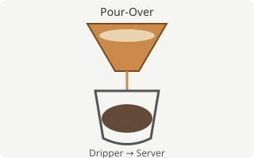

# Basics of Pour-Over Coffee

The taste of coffee changes a lot depending on how it's brewed. Here we'll look at the basic ideas using **pour-over**, a method that's easy to reproduce at home, as an example.

## What You'll Need

Here's the list of equipment.

### Essential Equipment

- A dripper and paper filter
- A server (a vessel to catch the coffee)
- A drip kettle (with a thin spout)
- A scale (that can measure in 1g increments)
- A timer

### Nice-to-Have Equipment

- A thermometer (if you want to measure the water temperature precisely)
- A grinder (if you want to use freshly ground beans)

> A water temperature around 90°C (194°F) is a good guideline. Using water straight off the boil tends to bring out more bitterness.

## Brewing Steps

1. Set the filter in the dripper, rinse it with hot water, and discard the water.
2. Add the ground coffee to the dripper and level the surface.
3. Pour water equal to about twice the weight of the coffee, and let it bloom for about 30 seconds.
4. Pour the remaining water in several pours, moving in a circular motion.
5. Remove the dripper once the target amount has been extracted, before all the water has drained through.

The diagram below is a simplified illustration of coffee dripping from the dripper into the server.



Writing an HTML `` tag directly is treated the same way, and attributes like `width` let you control the display size.


### Blooming and Pouring Technique

The "Brewing Steps" above may look simple, but the way you bloom and pour actually has a big effect on the final result. Let's dig into two particularly important points.

#### How Long to Bloom

Adjust the bloom time based on how fresh the beans are.

- Freshly ground beans: bloom for about 30–40 seconds.
- Beans ground a few days ago: about 20–30 seconds is enough, since they release less gas.

An insufficient bloom lets the water channel unevenly, which leads to uneven extraction.

#### Pouring Pace

From the second pour onward, pouring at a steady pace in a circular motion, from the center of the dripper outward, gives a more stable extraction. Be careful not to pour water directly against the edge of the filter.

## The Ratio of Coffee to Water (Brew Ratio)

Generally, the strength of coffee is determined largely by the ratio of water to coffee (the brew ratio). The brew ratio $R$ can be expressed using the amount of water $W$ (g) and the amount of coffee $C$ (g) as follows.

$$
R = \frac{W}{C}
$$

It depends on personal taste, but adjusting so that $R$ is roughly between 15 and 16 gets you close to a standard strength. The table below shows guideline amounts for different coffee quantities.

| Coffee (g) | Water at ratio 15 (g) | Water at ratio 16 (g) | Approx. yield |
| ---------: | ---------------------: | ---------------------: | :------------ |
| 10         | 150                     | 160                     | ~1 cup        |
| 15         | 225                     | 240                     | ~1.5 cups     |
| 20         | 300                     | 320                     | ~2 cups       |
| 30         | 450                     | 480                     | ~3 cups       |

### Thinking About the Brew Ratio

Raising the brew ratio $R$ (more water) makes the coffee weaker, while lowering it makes it stronger. Since changing the ratio alone can drastically change the impression of the same beans, it's a good idea to start from the baseline of 15–16 and adjust from there.

### Reading the Reference Table

The table above lists the water amounts for brew ratios of 15 and 16. Treat the values as guidelines only, and fine-tune them based on the roast level of the beans and your own taste.

## A Script to Calculate the Water Amount

As a simple example of calculating the water amount from the coffee amount, here is some JavaScript code.

```javascript
/**
 * Calculate the required amount of water (g) from the amount of coffee (g) and the brew ratio.
 * @param {number} coffeeGrams Amount of coffee (g)
 * @param {number} ratio Brew ratio (water / coffee)
 * @returns {number} Amount of water (g)
 */
function calcWaterAmount(coffeeGrams, ratio = 15.5) {
  return Math.round(coffeeGrams * ratio);
}

console.log(calcWaterAmount(20)); // => 310
```

To show code inline, wrap it in backticks like `calcWaterAmount(20, 16)`.

### Checking the Output

Running the function above produces output like the following.

```text
$ node calc.js
310
```

In other words, for 20g of coffee, aiming for roughly 310g of water is a good guideline.

## Summary

- Aim for a water temperature around 90°C and a brew ratio of roughly 15–16.
- Including a bloom time lets gas escape and helps achieve a more even extraction.
- If you're interested in more detailed extraction theory, [the Wikipedia article on coffee extraction](https://en.wikipedia.org/wiki/Coffee_extraction) is also a good reference.

---

That covers the basic ideas behind pour-over coffee.
