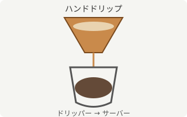

# ハンドドリップコーヒーの基礎

コーヒーは淹れ方によって味が大きく変わります。ここでは、家庭でも再現しやすい**ハンドドリップ**を例に、基本的な考え方を整理します。

## 準備するもの

道具は次の通りです。

### 必須の道具

- ドリッパーとペーパーフィルター
- サーバー（受け皿になる容器）
- ドリップケトル（注ぎ口が細いもの）
- はかり（1g単位で計測できるもの）
- タイマー

### あると便利な道具

- 温度計（湯温を正確に測りたい場合）
- ミル（豆を挽きたてで使いたい場合）

> 湯温は 90℃ 前後が目安です。沸騰直後の湯を使うと苦味が強く出やすくなります。

## 抽出の手順

1. フィルターをドリッパーにセットし、湯通ししてお湯を捨てる。
2. 挽いた豆をドリッパーに入れ、表面を平らにならす。
3. 豆の重さの約2倍の湯を注ぎ、30秒ほど蒸らす。
4. 残りの湯を数回に分けて円を描くように注ぐ。
5. 湯が落ち切る前に、目標の抽出量に達したらドリッパーを外す。

下の図は、ドリッパーからサーバーへコーヒーが落ちていく様子を単純化したものです。



HTMLの `` タグを直接書いても同じ画像として扱われ、`width` のような属性で表示サイズを指定できます。


### 蒸らしと注湯のコツ

一見単純に見える「抽出の手順」ですが、実際には蒸らし方と注ぎ方によって仕上がりが大きく変わります。ここでは特に重要な2点を掘り下げます。

#### 蒸らし時間の目安

蒸らし時間は豆の鮮度に応じて調整するとよいでしょう。

- 挽きたての新鮮な豆: 30〜40秒ほど蒸らす。
- 挽いてから数日経った豆: ガスの量が減っているため、20〜30秒ほどで十分。

蒸らしが不十分だと、お湯が偏って抽出ムラの原因になります。

#### 注湯のペース

2投目以降は、ドリッパーの中心から外側に向かって円を描くように、一定のペースで注ぐと安定した抽出になります。フィルターの縁に直接お湯がかからないように注意してください。

## 豆と湯の比率（抽出比）

一般的に、コーヒーの濃さは豆の量に対する湯量の比率（抽出比）でおおよそ決まります。抽出比 $R$ は、湯量 $W$ (g) と豆の量 $C$ (g) を使って次のように表せます。

$$
R = \frac{W}{C}
$$

好みにもよりますが、$R$ がだいたい 15〜16 程度になるように調整すると、標準的な濃さに近づきます。豆の量ごとの目安量を表にまとめました。

| 豆の量 (g) | 抽出比 15 の場合の湯量 (g) | 抽出比 16 の場合の湯量 (g) | 出来上がり杯数の目安 |
| ---------: | --------------------------: | --------------------------: | :------------------- |
| 10         | 150                          | 160                          | 約1杯                |
| 15         | 225                          | 240                          | 約1.5杯              |
| 20         | 300                          | 320                          | 約2杯                |
| 30         | 450                          | 480                          | 約3杯                |

### 抽出比の考え方

抽出比 $R$ を高くする（湯量を増やす）と味は薄く、低くすると濃くなります。同じ豆でも抽出比を変えるだけで印象が大きく変わるため、まずは基準値である15〜16から試してみるのがおすすめです。

### 早見表の見方

上の表は抽出比15と16の場合の湯量を並べたものです。表の値はあくまで目安であり、豆の焙煎度や好みに応じて微調整してください。

## 湯量を計算するスクリプト

豆の量から湯量を計算する簡単な例として、JavaScript のコードを示します。

```javascript
/**
 * 豆の量(g)と抽出比から、必要な湯量(g)を計算する。
 * @param {number} coffeeGrams 豆の量 (g)
 * @param {number} ratio 抽出比（湯量 / 豆の量）
 * @returns {number} 湯量 (g)
 */
function calcWaterAmount(coffeeGrams, ratio = 15.5) {
  return Math.round(coffeeGrams * ratio);
}

console.log(calcWaterAmount(20)); // => 310
```

インラインでコードを示したい場合は、`calcWaterAmount(20, 16)` のようにバッククォートで囲んで表記します。

### 実行結果の確認

上記の関数を実行すると、次のような出力が得られます。

```text
$ node calc.js
310
```

このように、20gの豆に対しては約310gの湯を目安にすればよいことが分かります。

## まとめ

- 湯温は90℃前後、抽出比はおおよそ15〜16を目安にする。
- 蒸らし時間を挟むことでガスを抜き、均一に抽出できる。
- 詳しい抽出理論に興味がある場合は、[コーヒーの抽出に関する解説（Wikipedia）](https://ja.wikipedia.org/wiki/%E3%82%B3%E3%83%BC%E3%83%92%E3%83%BC)なども参考になります。

---

以上が、ハンドドリップコーヒーの基礎的な考え方です。
