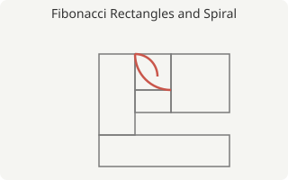

# The Fibonacci Sequence and the Golden Ratio

The **Fibonacci sequence** is a sequence built from a simple rule: each term is the sum of the two preceding terms. Despite this simple rule, similar patterns are known to appear in many places in nature, such as the number of petals on a flower or the pattern of a seashell.

## Definition

The sequence $F_n$ is defined by the following **recurrence relation**.

$$
F_0 = 0, \quad F_1 = 1, \quad F_n = F_{n-1} + F_{n-2} \quad (n \ge 2)
$$

Writing out the first several terms gives the following.

| $n$ | 0 | 1 | 2 | 3 | 4 | 5 | 6 | 7 | 8  | 9  | 10 |
| --: | -: | -: | -: | -: | -: | -: | -: | -: | -: | -: | -: |
| $F_n$ | 0 | 1 | 1 | 2 | 3 | 5 | 8 | 13 | 21 | 34 | 55 |

## Relationship to the Golden Ratio

As $n$ grows, the ratio of consecutive terms $F_{n+1} / F_n$ is known to approach the **golden ratio** $\varphi$. The golden ratio is the constant defined by the following equation.

$$
\varphi = \frac{1 + \sqrt{5}}{2} \approx 1.6180339887\ldots
$$

If you remove a square from a rectangle whose side ratio is the golden ratio (a golden rectangle), the remaining rectangle is again a golden rectangle. Repeating this process traces out a spiral like the one shown below.



### Properties of the Golden Rectangle

Repeating the process of removing a square from a golden rectangle keeps producing similar golden rectangles, nested inside one another. This property is called "self-similarity," and it's related to fractal shapes as well.

#### How to Construct the Spiral

The golden spiral shown above can be constructed with the following steps.

1. Draw a golden rectangle.
2. Cut off a square whose side equals the shorter side of the rectangle.
3. From the rectangle that remains (itself a golden rectangle), cut off another square.
4. Repeat this process, and draw a quarter-circle arc inside each square that was cut off.

## Binet's Formula

As a way to compute $F_n$ directly without using the recurrence relation, the following **Binet's formula** is known.

$$
F_n = \frac{\varphi^{n} - \psi^{n}}{\sqrt{5}}, \qquad \psi = \frac{1 - \sqrt{5}}{2}
$$

### A Quick Sanity Check

For example, at $n = 10$, $\varphi^{10} \approx 122.99$ and $\psi^{10} \approx 0.0081$. Dividing their difference by $\sqrt{5}$ gives a value close to $F_{10} = 55$, aside from rounding error.

## Example Implementation in Python

Turning the recurrence relation directly into code looks like this.

```python
def fibonacci(n: int) -> int:
    """Return the nth Fibonacci number (0-indexed)."""
    a, b = 0, 1
    for _ in range(n):
        a, b = b, a + b
    return a


if __name__ == "__main__":
    for i in range(11):
        print(i, fibonacci(i))
```

Running this code, `fibonacci(10)` returns `55`. Its time complexity is $O(n)$.

### Why This Implementation Works Well

This code only uses addition, and avoids both exponentiation and recursive calls, so it stays fast even for large values of $n$.

#### A Note on Complexity

The loop runs exactly $n$ times, so the time complexity is $O(n)$. By contrast, if you rewrite this as a naive recursive version that calls itself twice per term, the time complexity grows exponentially instead.

## Additional Notes

- As the number of terms in the sequence increases, the error between the ratio $F_{n+1}/F_n$ and the golden ratio $\varphi$ becomes smaller.
- The golden ratio is called the *golden ratio* in English, and it is commonly denoted by the Greek letter $\varphi$ (phi).

That concludes this brief introduction to the Fibonacci sequence and the golden ratio.
