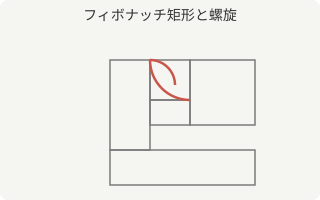

# フィボナッチ数列と黄金比

**フィボナッチ数列**は、直前の2つの項の和が次の項になるという単純な規則で作られる数列です。単純な規則にもかかわらず、自然界の様々な場所（花びらの枚数や貝殻の模様など）に類似のパターンが現れることで知られています。

## 定義

数列 $F_n$ は、次の**漸化式**で定義されます。

$$
F_0 = 0, \quad F_1 = 1, \quad F_n = F_{n-1} + F_{n-2} \quad (n \ge 2)
$$

最初の項をいくつか書き出すと、以下のようになります。

| $n$ | 0 | 1 | 2 | 3 | 4 | 5 | 6 | 7 | 8  | 9  | 10 |
| --: | -: | -: | -: | -: | -: | -: | -: | -: | -: | -: | -: |
| $F_n$ | 0 | 1 | 1 | 2 | 3 | 5 | 8 | 13 | 21 | 34 | 55 |

## 黄金比との関係

隣り合う項の比 $F_{n+1} / F_n$ は、$n$ を大きくしていくと**黄金比** $\varphi$ に近づいていくことが知られています。黄金比は次の式で定義される定数です。

$$
\varphi = \frac{1 + \sqrt{5}}{2} \approx 1.6180339887\ldots
$$

黄金比を1辺の比とする長方形（黄金長方形）から正方形を1つ取り除くと、また黄金長方形が残るという性質があり、これを繰り返すことで下図のような螺旋を描くことができます。



### 黄金長方形の性質

黄金長方形から正方形を取り除く操作を繰り返すと、相似な黄金長方形が入れ子状に現れ続けます。この性質は「自己相似性」と呼ばれ、フラクタル図形とも関連があります。

#### 螺旋の作図手順

図のような黄金螺旋は、次の手順で作図できます。

1. 黄金長方形を1つ描く。
2. 長辺を1辺とする正方形を切り出す。
3. 残った長方形（これも黄金長方形になる）から、再び正方形を切り出す。
4. これを繰り返し、切り出した各正方形の中に四分円弧を描き入れる。

## ビネの公式

漸化式を使わずに $F_n$ を直接計算する方法として、次の**ビネの公式**が知られています。

$$
F_n = \frac{\varphi^{n} - \psi^{n}}{\sqrt{5}}, \qquad \psi = \frac{1 - \sqrt{5}}{2}
$$

### 公式の簡単な確認

例えば $n = 10$ のとき、$\varphi^{10} \approx 122.99$、$\psi^{10} \approx 0.0081$ となります。これらの差を $\sqrt{5}$ で割ると、丸め誤差を除いて $F_{10} = 55$ に近い値が得られます。

## Pythonでの実装例

漸化式をそのままコードにすると、次のようになります。

```python
def fibonacci(n: int) -> int:
    """n番目（0始まり）のフィボナッチ数を返す。"""
    a, b = 0, 1
    for _ in range(n):
        a, b = b, a + b
    return a


if __name__ == "__main__":
    for i in range(11):
        print(i, fibonacci(i))
```

このコードを実行すると、`fibonacci(10)` は `55` を返します。計算量は $O(n)$ です。

### 実装のポイント

このコードは加算のみを使っており、べき乗の計算や再帰呼び出しを避けているため、大きな $n$ に対しても高速に動作します。

#### 計算量について

ループは $n$ 回だけ実行されるため、計算量は $O(n)$ です。一方、各項を2回の再帰呼び出しで求める素朴な再帰版に書き換えると、計算量が指数的に増加してしまう点に注意してください。

## 補足

- 数列の項数が増えるほど、比 $F_{n+1}/F_n$ と黄金比 $\varphi$ の誤差は小さくなります。
- 黄金比は英語で *golden ratio* と呼ばれ、記号にはギリシャ文字 $\varphi$（ファイ）がよく使われます。

以上、フィボナッチ数列と黄金比の簡単な紹介でした。
